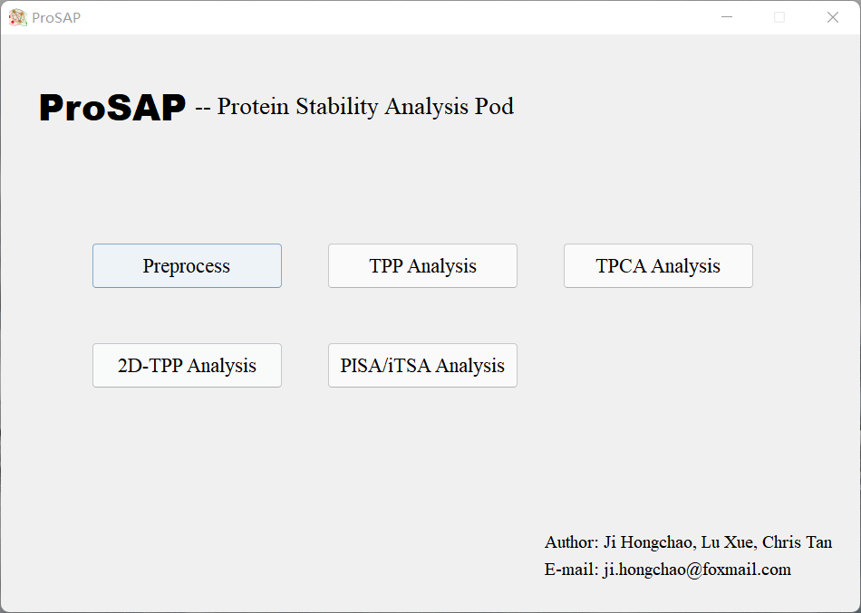
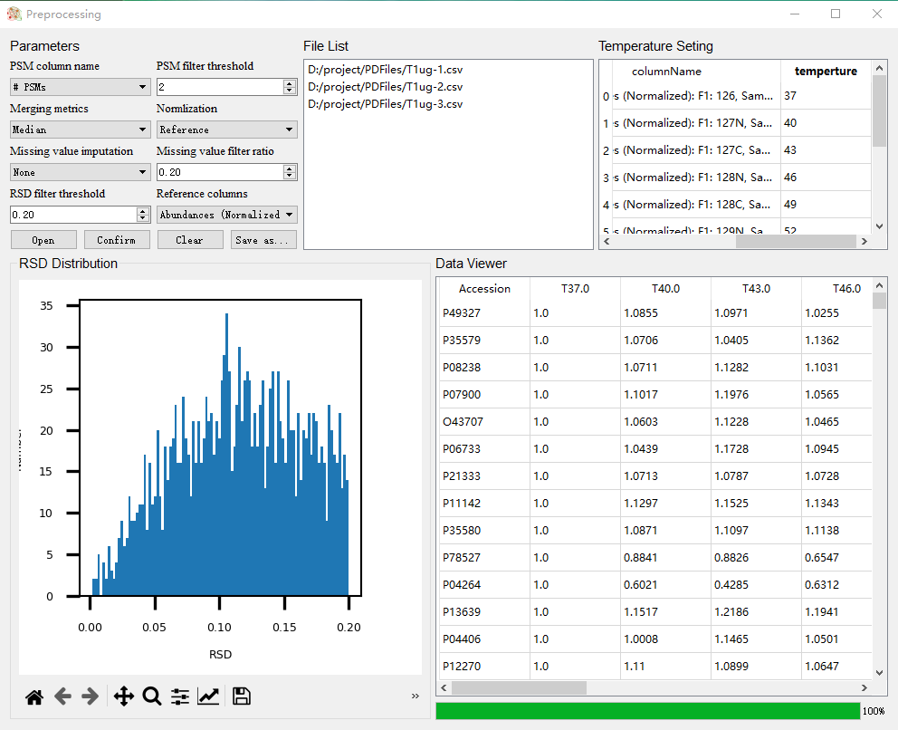
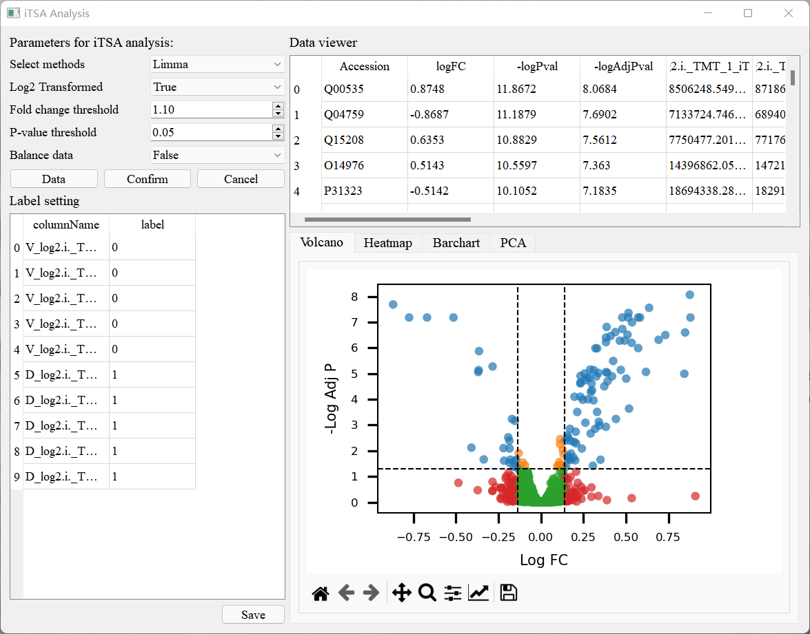

# General Features
The main interface of ProSAP includes four buttons corresponding to the function modules.
 Generally the export file of Proteome Discoverer or MaxQuant should be preprocessed first.
 For different experimental purpose, you may need PISA/iTSA analysis, TPP analysis, 2D-TPP analysis
 and/or TPCA analysis, just push the corresponding buttons.

# Data Preprocessing
Data preprocessing module aims to transform the proteomics quantitative table given by mass-spectrometric
 analyzing software into the acceptable data matrix of ProSAP.
 [Video of example](https://github.com/hcji/ProSAP/blob/master/video/ProSAP_Preprocessing.mp4)

**Usage**:  

1. Click 'Open' button, select raw data files output by PD software.
 ProSAP can accept single or multiple files. If there is no technical replicates in this step, it is alright to
 choose a single file. Note that technical replicates will be merged to one data matrix, which is not equal
 to sample replicates used for TPP analysis.
 [Example files](https://github.com/hcji/ProSAP/tree/master/data/Rawfiles)

2. If you need remove proteins with low PSM values, please choose the column correspending to the PSM
 values at 'PSM column name' combo box.

3. Choose how to merge the values of multiple technical replicates. 
 
4. Choose the normlization method. For TPP analysis, usually use 'reference' method, i.e. all the
 columns are divided to the reference column; For iTSA method, usually use median method,
 which is similar to the standard normalization in proteomics analysis. If 'reference' method is used,
 please choose which column is set as reference in the 'Reference column' combo box.

5. Choose the missing value imputation method. 'KNN' means use KNN based missing value 
 impuataion; 'Zero' means replace missing values as 0.

6. Input the RSD threshold for filtering proteins with high RSD in technical replicates. 
 If only one file is input, ignore it.  

7. Click 'confirm' button, and wait for finishing.

8. Save the results.

# iTSA/PISA Analysis
Although the experimental protocol of PISA and iTSA are different. PISA mixes samples under different
 tempertures, while iTSA uses single experimental temperture. However, their statistical
 analysis can be similar. The core is to determine whether a protein is significantly different
 between case and control groups. ProSAP implements four different methods for this purpose,
 which are t-test, Limma, edgeR, and DESeq2. 
[Video of example](https://github.com/hcji/ProSAP/blob/master/video/ProSAP_iTSA_PISA.mp4)

**Note**:  
Both edgeR and DESeq2 are designed for designed for count data of transcriptomics with negative binomial
 distribution assumption. They were also applied in proteomics in some recent works. So, they are
 embedded in ProSAP as options. However, the applicability may need more experimental validation.

**Usage**:  
  
1. Click 'Data' button, and select a quantitative data file of proteomics. The first
 column of the data table should be 'Accession', which could be gene name, uniprot id,
 or any other index. [Example files](https://github.com/hcji/ProSAP/tree/master/data/PISA).

2. Select columns representing protein abundences. If the abundances have been log2
 transformed, you should set 'log2 transformed' combo box as 'True'.

3. Select statistical method and parameters, then click 'Confirm' button

# TPP/NPA Analysis
The workflow of TPP analysis is implemented under the Savitski protocol. Nonparametric
 analysis (NPA) is an alternative method of TPP analysis. It aims to avoid the arbitrary
 of parameter setting in TPP analysis. NPA includes two different strategies: fitness-based
 model and distance-based model. Fitness-based model is mainly followed the NPARC method
 Distance based model is more straightforward, the data of case and control groups are fitted
 into melting curve, respectively. Various kinds of distance functions, such as Euclidean,
 Cityblock, Chebychev or cosine function.
 [Video of example](https://github.com/hcji/ProSAP/blob/master/video/ProSAP_TPP.mp4)

**Usage:**  

1. Click 'Data' menu and load proteomics files. Please select multiple preprocessed data files.
 one or two replicates of control group, and one or two replicates of case group.
 The first column of each file should be 'Accession'.
 [Example files](https://github.com/hcji/ProSAP/tree/master/data/TPP).

2. Take turns to select data files and click 'Rep 1 Control', 'Rep 1 Case', 'Rep 2 Control' and
 'Rep 2 Case'. In the meantime, the data are browsed.

3. Click 'Params' button and set the parameters, then click 'Analysis' menu and choose
 the statistical method. The process will take some minutes.

4. View and save the results. The melting curve of proteins can be visulized by clicking the 'Show Curve' button.

# TPCA Analysis
TPCA is an analysis method of coaggregation of proteins based on TPP experiments. ProSAP
 implements the TPCA procedure for visualizing protein complex dynamic changing and
 protein pair prediction.Moreover ProSAP also calculate p value for sorting the protein
 complex in database, which assists users to find which protein complex changes most significantly.
 [Video of example](https://github.com/hcji/ProSAP/blob/master/video/ProSAP_TPCA.mp4)

**Usage:**  

1. Click 'Data' menu and load proteomics files. Please select multiple preprocessed data files.
 one for control group, and one for of case group. The first column of each file should be 'Accession',
 and the 'Accession' must be uniprot ID. [Example files](https://github.com/hcji/ProSAP/tree/master/data/TPCA).

2. Take turns to select data files and click 'Set as G1', 'Set as G2'. In the meantime, the data are browsed.

3. Click 'Data' menu and load protein complex database. The database file should include 'Complex_ID'
 and 'Subunits_UniProt_IDs'. The 'Subunits_UniProt_IDs' must represented by uniprot ID

4. Select the database file to be used, and click 'Confirm' button. Example database is available at here

5. Click 'Calc Change' button. The processing will take some minutes.

6. The protein complex will be sorted by the changing significance, using p-value as numerical description

7. View and save the results. The melting curve of proteins can be visulized by clicking the 'Show Curve' button.

8. If you want to calculate protein pair dynamic changing and/or evaluate the prediction performance of
 PPI, just click 'Analysis' menu, and select 'Protein pair analysis'
 

# 2D-TPP analysis

2D-TPP employs a multiplexed MS analysis of samples in the presence of n ligand concentrations
 (including a vehicle control) at m temperatures. The additional drug concentration dimension
 of 2D-TPP enables more sensitive detection of off-target targets. The 2D-TPP analysis of ProSAP is implemented
 based on the R package proposed by Savitski et al.
 

