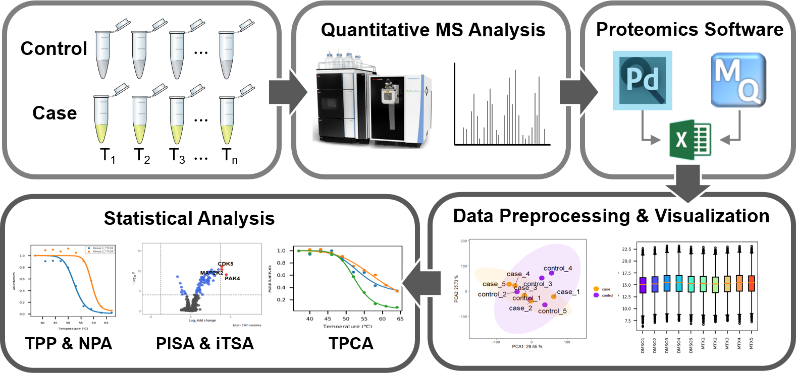

# 

# About ProSAP

  ProSAP Desktop is an integrated open-source framework for data analysis related to thermal shift assays. 
The graphical user interface is organized with QT platform, and the functions were written in Python and 
R programming languages. At present, it provides data conversion and preprocessing (including normalization, 
missing value imputation, etc.), conventional thermal proteome profiling (TPP) analysis, nonparametric TPP 
analysis (NPA), isothermal shift analysis (iTSA) and thermal proximity coaggregation analysis (TPCA).  

  The software is developed by Tan Lab (Southern University of Science and Technology, China PR). 
The original author and current maintainer is Ji Hongchao (ji.hongchao@foxmail.com) Anyone can use, modify and 
convey the software under GPL (>=3.0) license. For reporting bugs or requesting new features, you can 
put forward issues at: https://github.com/hcji/ProSAP/issues.

# Change log
v 0.99.5  
- Support 2D-TPP analysis  
- R is no longer necessary  

v 0.99.4  
- Support MacOS platform  
- Suppress R concole output to fix 'cffi warning'  

v 0.99.3  
- Automatically install R-4.1.0, if R not in your system  
- Fix R failed error with code:2  

v 0.99.2  
- Conventional TPP analysis, nonparametric TPP analysis and iTSA analysis  
- Data preprocessing, normalization, missing value imputation  
- Thermal shift curve fitting and visualization  

# Citation

* Hongchao Ji, Xue Lu, Zhenxiang Zheng, Siyuan Sun, Chris Song Heng Tan*, 
ProSAP: A GUI Software Tool for Statistical Analysis and Assessment of Thermal Stability Data，
Briefings in Bioinformation, In Revision.

